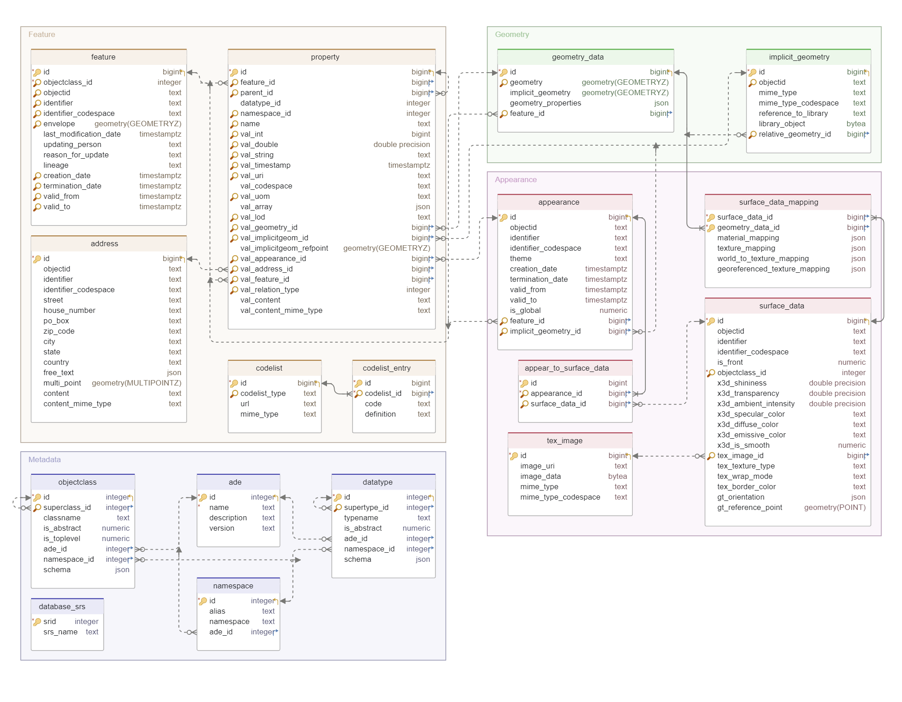

Since version 5, the database schema has been completely redesigned and reworked. There are no individual feature tables with columns for attributes anymore. Instead, the database schema is minimized with fewer tables. For example, a Feature table for all features and objects, and a PROPERTY table for almost all attributes and associations. The following figure presents an overview of the relational database structure, where all tables can be logically grouped into three modules:

- **Metadata Module**: containing tables for the meta-information of the features and their properties.
- **Feature Module**: containing the core tables for storing feature information except geometry and appearance information
- **Geometry Module**: containing tables for storing explicit and implicit geometry data information
- **Appearance Module**: containing tables for storing appearance information


> Figure 1. Relation Schema of the new 3D City Database Version 5

## Metadata Module

### NAMESPACE table

The new 3DCityDB version 5 is mainly designed for supporting CityGML 3.0 as well as for the old version 2.0 and 1.0. However, the same feature class from different CityGML versions have different namespaces. In order to assign a unique namespace for a feature class e.g. Building, a set of new 3DCityDB native namespaces have been defined, which are stored in the table NAMESPACE and can be prefilled after the setup of 3DCityDB instance automatically. A full list of the namespaces are shown in the following table. The definition of the prefilled 3DCityDB namespaces follows the standard modulation to the CityGML 3.0 abstract model. Hence, all values of the last column ``ADE_ID`` is NULL for these standard namespaces. When adding a new CityGML ADE extensions, its namespace should be first registered in this table, and the ``ADE_ID`` value should then be filled and reference to the ADE table, where all ADEs are registered.

| id  | alias | namespace                                          | ade_id |
| --- | ----- | -------------------------------------------------- | ------ |
| 1   | core  | <http://3dcitydb.org/3dcitydb/core/5.0>            | NULL   |
| 2   | dyn   | <http://3dcitydb.org/3dcitydb/dynamizer/5.0>       | NULL   |
| 3   | gen   | <http://3dcitydb.org/3dcitydb/generics/5.0>        | NULL   |
| 4   | luse  | <http://3dcitydb.org/3dcitydb/landuse/5.0>         | NULL   |
| 5   | pcl   | <http://3dcitydb.org/3dcitydb/pointcloud/5.0>      | NULL   |
| 6   | dem   | <http://3dcitydb.org/3dcitydb/relief/5.0>          | NULL   |
| 7   | tran  | <http://3dcitydb.org/3dcitydb/transportation/5.0>  | NULL   |
| 8   | con   | <http://3dcitydb.org/3dcitydb/construction/5.0>    | NULL   |
| 9   | tun   | <http://3dcitydb.org/3dcitydb/tunnel/5.0>          | NULL   |
| 10  | bldg  | <http://3dcitydb.org/3dcitydb/building/5.0>        | NULL   |
| 11  | brid  | <http://3dcitydb.org/3dcitydb/bridge/5.0>          | NULL   |
| 12  | app   | <http://3dcitydb.org/3dcitydb/appearance/5.0>      | NULL   |
| 13  | grp   | <http://3dcitydb.org/3dcitydb/cityobjectgroup/5.0> | NULL   |
| 14  | veg   | <http://3dcitydb.org/3dcitydb/vegetation/5.0>      | NULL   |
| 15  | vers  | <http://3dcitydb.org/3dcitydb/versioning/5.0>      | NULL   |
| 16  | wtr   | <http://3dcitydb.org/3dcitydb/waterbody/5.0>       | NULL   |
| 17  | frn   | <http://3dcitydb.org/3dcitydb/cityfurniture/5.0>   | NULL   |
| 18  | depr  | <http://3dcitydb.org/3dcitydb/deprecated/5.0>      | NULL   |

### ADE table

The table ADE serves as a central registry for all the registered extensions e.g. CityGML ADEs, each of which corresponds to a table row. The relevant ADE metadata attributes are mapped onto the respective columns. For example, each registered ADE receives a unique ID value in the database, that can be referenced by the belonging namespaces in the table namespace. The columns NAME and DESCRIPTION are mainly used for storing a basic description about each ADE. The column VERSION denotes the version number of an ADE and allows to distinguish different ADE versions, which might be compatible with different CityGML versions.

### OBJECTCLASS table

The table OBJECTCLASS is a central registry for enumerating not only the standard CityGML classes, but also the classes of the registered ADEs. In this table, Each class is assigned a globally unique numeric ID for querying and accessing the class-related information stored in the columns CLASSNAME, IS_ABSTRACT and IS_TOPLEVEL. The SCHEMA column stores the schema mapping information, which are in JSON structured and describe how the corresponding class is mapped to a database table.

Example of the schema mapping for the ADDRESS class

``` json
{
  "identifier": "core:Address",
  "table": "address",
  "properties": [
    {
      "name": "objectId",
      "namespace": "http://3dcitydb.org/3dcitydb/core/5.0",
      "value": {
        "column": "objectid",
        "type": "string"
      }
    },
    {
      "name": "identifier",
      "namespace": "http://3dcitydb.org/3dcitydb/core/5.0",
      "value": {
        "column": "identifier",
        "type": "string"
      }
    },
    {
      "name": "codeSpace",
      "namespace": "http://3dcitydb.org/3dcitydb/core/5.0",
      "value": {
        "column": "identifier_codespace",
        "type": "string"
      },
      "parent": 1
    },
    {
      "name": "street",
      "namespace": "http://3dcitydb.org/3dcitydb/core/5.0",
      "value": {
        "column": "street",
        "type": "string"
      }
    },
    {
      "name": "houseNumber",
      "namespace": "http://3dcitydb.org/3dcitydb/core/5.0",
      "value": {
        "column": "house_number",
        "type": "string"
      }
    },
    {
      "name": "poBox",
      "namespace": "http://3dcitydb.org/3dcitydb/core/5.0",
      "value": {
        "column": "po_box",
        "type": "string"
      }
    },
    {
      "name": "zipCode",
      "namespace": "http://3dcitydb.org/3dcitydb/core/5.0",
      "value": {
        "column": "zip_code",
        "type": "string"
      }
    },
    {
      "name": "city",
      "namespace": "http://3dcitydb.org/3dcitydb/core/5.0",
      "value": {
        "column": "city",
        "type": "string"
      }
    },
    {
      "name": "state",
      "namespace": "http://3dcitydb.org/3dcitydb/core/5.0",
      "value": {
        "column": "state",
        "type": "string"
      }
    },
    {
      "name": "country",
      "namespace": "http://3dcitydb.org/3dcitydb/core/5.0",
      "value": {
        "column": "country",
        "type": "string"
      }
    },
    {
      "name": "multiPoint",
      "namespace": "http://3dcitydb.org/3dcitydb/core/5.0",
      "value": {
        "column": "multi_point",
        "type": "core:MultiPoint"
      }
    }
  ]
}
```

The column ``SUPERCLASS_ID`` is a foreign key referencing to the super class id for representing the inheritance hierarchy of all classes. The last foreign key columns ``namepsace_id`` and ``ade_id`` can be used for retrieving the namespace and ADE information from the two above-mentioned NAMESPACE and ADE tables.

### DATATYPE table

Similar to the ``OBJECTCLASS`` table, The ``DATATYPE`` table is a central registry for all simple and complex data types. Each class is assigned a globally unique numeric ID for querying and accessing the datatype-related information stored in the columns ``TYPENAME``, ``IS_ABSTRACT``, and ``IS_TOPLEVEL``. There is also a column schema for storing the schema mapping information in JSON format.

Example of the schema mapping for the data type AddressProperty

``` json
{
  "identifier": "core:AddressProperty",
  "table": "property",
  "join": {
    "table": "address",
    "fromColumn": "val_address_id",
    "toColumn": "id"
  }
}
```

The column ``SUPERTYPE_ID`` referencing to the super datatype id can be used for representing the inheritance hierarchy of all the registered data types. The namespace and ADE information of each data type are also achievable over the columns ``NAMESAPCE_ID`` and ``ADE_ID`` respectively.

### DATABASE_SRS table

The definition of the CRS of a 3D City Database instance consists of two components:

1. A valid Spatial Reference Identifier (SRID, typically the EPSG code) and
2. A definition identifier for the CRS. For example an OGC GML conformant CRS definition identifier

Both components are defined during the [database setup](./../first-steps/setup.md) and are further stored in the table ``DATABASE_SRS``.

## Feature Module

### FEATURE table

The ``FEATURE`` table plays a central role in this module. All objects contained in the city model are listed here and uniquely identified with primary key ID within the database. The ``OBJECTID`` is the string to distinguish all (top-level) features and possible multiple versions of the same real-world object. In the contrast, The value combination of the ``IDENTIFIER`` and ``IDENTIFIER_CODESPACE`` for all versions of the same real-world object. Besides, additional metadata attributes are stored in this table. for example, the ``objectclass_id`` allows for classification and identification of the features. A full list of the objectclass id can be found in the metadata table ``OBJECTCLASS``. The 3D envelopes (i.e. minimal enclosing rectangle) of the features are also available for fast spatial database queries. The Versioning and history information (last modification date, updating person, data origin, etc.) in the respective columns.

### PROPERTY table

Since version 5.0, all feature properties except the address, geometry, and appearance information are stored in the ``PROPERTY`` table centrally. This table follows the idea of handling generic attributes in the 3DCityDB version 4. Each attribute is identified by attribute name and namespace. It also allows to related to owning feature and (if required) to target feature. The simple attributes are mapped to columns with corresponding data types. It also works for simple combined values(e.g., double with unit of measurement). The Spatial attributes store relation to the ``GEOMETRY_DATA`` table or the ``IMPLICIT_GEOMETRY`` table. For complex data types, a hierarchical structure can be used with multiple rows. For example, the CityGML Height datatype is a complex type, which consists of three child attributes **highReference**, **lowReference**, **status**, and **value**. To store such property information, 5 rows are needed and look like the following in the ``PROPERTY`` table:

| ID  | NAME             | PARENT_ID | VAL_STRING          | VAL_DOUBLE | ... |
| --- | ---------------- | --------- | ------------------- | ---------- | --- |
| 1   | "measuredHeight" | NULL      | NULL                | NULL       | ... |
| 2   | "highReference"  | 1         | "highestRoofEdge"   | NULL       | ... |
| 3   | "lowReference"   | 1         | "lowestGroundPoint" | NULL       | ... |
| 4   | "status"         | 1         | "measured"          | NULL       | ... |
| 5   | "value"          | 1         | NULL                | 11.0       | ... |

The corresponding schema mapping is defined as followings, which can be queried from the ``DATATYPE`` table.

``` json
{
  "identifier": "con:Height",
  "table": "property",
  "value": {
    "property": 0
  },
  "properties": [
    {
      "name": "value",
      "namespace": "http://3dcitydb.org/3dcitydb/construction/5.0",
      "type": "core:Measure",
      "join": {
        "table": "property",
        "fromColumn": "id",
        "toColumn": "parent_id"
      }
    },
    {
      "name": "status",
      "namespace": "http://3dcitydb.org/3dcitydb/construction/5.0",
      "type": "core:String",
      "join": {
        "table": "property",
        "fromColumn": "id",
        "toColumn": "parent_id"
      }
    },
    {
      "name": "lowReference",
      "namespace": "http://3dcitydb.org/3dcitydb/construction/5.0",
      "type": "core:Code",
      "join": {
        "table": "property",
        "fromColumn": "id",
        "toColumn": "parent_id"
      }
    },
    {
      "name": "highReference",
      "namespace": "http://3dcitydb.org/3dcitydb/construction/5.0",
      "type": "core:Code",
      "join": {
        "table": "property",
        "fromColumn": "id",
        "toColumn": "parent_id"
      }
    }
  ]
}
```

For certain complex datatype, it is also possible to store all data information using one single row in a compact way. For example, the CityGML ExternalReference data type consists of three simple attributes ``targetResource``, ``informationSystem`` and ``relationType``. It can be mapped onto one row like the followings:

| ID  | NAME                | PARENT_ID | VAL_URI           | VAL_CODESPACE   | VAL_STRING | ... |
| --- | ------------------- | --------- | ----------------- | --------------- | ---------- | --- |
| 1   | "externalReference" | NULL      | "target_resource" | "target_system" | "sameAs"   | ... |

The corresponding schema mapping is defined as followings:

``` json
{
  "identifier": "core:ExternalReference",
  "table": "property",
  "properties": [
    {
      "name": "targetResource",
      "namespace": "http://3dcitydb.org/3dcitydb/core/5.0",
      "type": "core:URI"
    },
    {
      "name": "informationSystem",
      "namespace": "http://3dcitydb.org/3dcitydb/core/5.0",
      "value": {
        "column": "val_codespace",
        "type": "uri"
      }
    },
    {
      "name": "relationType",
      "namespace": "http://3dcitydb.org/3dcitydb/core/5.0",
      "value": {
        "column": "val_string",
        "type": "uri"
      }
    }
  ]
}
```

### ADDRESS table

The address information are not stored in the ``PROPERTY`` table, but in a separate table ``ADDRESS``. Each address object is actually a feature object, and can hence also be identified by identifier, which are stored in the columns ``ID, OBJECTID, IDENTIFER`` and ``IDENTIFIER_CODESPACE``. The most common attribute information of an address can be mapped onto the columns ``STREET, HOUSE_NUMBER, PO_BOX, ZIP_CODE, CITY, STATE, COUNTRY`` and ``FREE_TEXT``, and the spatial position is stored in the column ``MULTI_POINT``. The last two column ``CONTENT`` and ``CONTENT_MIME_TYPE`` are introduced for storing the original address information of the input datasets. For example, CityGML uses the OASIS **eXtensible Address Language** (xAL) standard for representing the address information. However, the xAL is very flexible and supports various address styles that can be XML-encoded in many ways. When importing address information into the 3DCityDB, if the database importer is not able to parse the xAL address fragment, it can be simply stored in the CONTENT column. The encoding type of the content should be stored in the ``CONTENT_MIME_TYPE`` column. This way, no information will be lost during the database import.

Example of xAL address

``` xml
<core:Address>
  <!--
  Am Hang 15      street number and name
  85665 Moosach   postcode and locality
  Germany         country
  -->
  <core:xalAddress>
    <xAL:Address>
      <xAL:Country>
        <xAL:NameElement xAL:NameType="Name">Germany</xAL:NameElement>
      </xAL:Country>
      <xAL:Locality xAL:Type="Town">
        <xAL:NameElement xAL:NameType="Name">Moosach</xAL:NameElement>
      </xAL:Locality>
      <xAL:Thoroughfare xAL:Type="Street">
        <xAL:NameElement xAL:NameType="NameAndType">Am Hang</xAL:NameElement>
        <xAL:Number xAL:Type="Number">15</xAL:Number>
      </xAL:Thoroughfare>
      <xAL:PostCode>
        <xAL:Identifier>85665</xAL:Identifier>
      </xAL:PostCode>
    </xAL:Address>
  </core:xalAddress>
  <core:multiPoint>
    <gml:MultiPoint srsName="urn:ogc:def:crs:EPSG::4326">
      <gml:pointMember>
        <gml:Point>
          <gml:pos>48.03616458630443 11.873209628265858</gml:pos>
        </gml:Point>
      </gml:pointMember>
    </gml:MultiPoint>
  </core:multiPoint>
</core:Address>
```

Example of xAL address

```xml
<core:Address>
  <core:xalAddress>
    <xAL:Address>
      <xAL:FreeTextAddress>
        <xAL:AddressLine>Opéra National de Lyon</xAL:AddressLine>
        <xAL:AddressLine>1 Place de la Comédie</xAL:AddressLine>
        <xAL:AddressLine>69001 Lyon</xAL:AddressLine>
        <xAL:AddressLine>France</xAL:AddressLine>
      </xAL:FreeTextAddress>
    </xAL:Address>
  </core:xalAddress>
</core:Address>
```

### CODELIST and CODELIST_ENTRY tables

The CODELIST table is designed for registering code list used in the datasets, the ``CODELIST_TYPE`` column stores the qualified type of the code list (e.g. core:RelationTypeValue or bldg:BuildingClassValue). The URL column can be used for storing to an existing file in the Web containing the entire code list. The last column ``MIMETYPE`` allows to store the MIME type of the code list file (e.g. application/xml or application/json).

!!! info "NOTE"
    Different code lists could be stored for the same ``CODELIST_TYPE`` (e.g. one for bldg:BuildingClassValue by the German cadastre and one from the Japanese government). In this case we would have two rows in the table with the same ``CODELIST_TYPE`` (in this example bldg:BuildingClassValue), but with different url values.

The ``CODELIST_ENTRY`` table is mainly used for storing all the code values of a code list. It is very useful, when the user wants to check if a code used in the PROPERTY table is really defined in the named code list. It is also very helpful, when the code list should also be exported together with the output dataset . In the ``CODELIST_ENTRY`` table, the ``CODELIST_ID`` is a foreign key referencing to the ``CODELIST`` table. The code value and its explanation are stored in the columns ``CODE`` and ``DEFINITION`` respectively.

## Geometry Module

### GEOMETRY_DATA table

Starting from version 5, the geometry table has been named to ``GEOMETRY_DATA`` and redesigned to store not only surface-based geometries (Polygon, MultiSurface, Solid etc.) but also points and curves. In addition, this table used the predefined spatial data types of the database to store every geometry using a single row, not only for the simple primitive geometries, but also for complex geometries e.g. Solid and MultiSurface. In consequence, the identifier of the nested polygons cannot be stored in a column anymore. However, this identifier is required for linking with the appearance module, in order to assign textures and colors. This is solved by means of introducing an additional column ``GEOMETRY_PROPERTIES``, which is based on a json structure for storing the detailed attribute information of the geometry and its nested geometries in case of complex geometry.

The following table shows, how a simple solid geometry is stored in the ``GEOMETRY_DATA`` table. The first column ``ID`` is used for uniquely identifying the geometry row in the database. The ``GEOMETRY`` column uses the binary WKT format to store all belonging polygons based on the WKT’s ``MULTIPOLYGON``.

| id  | geometry     | implicit_geometry | geometry_property | feature_id |
| --- | ------------ | ----------------- | ----------------- | ---------- |
| 1   | {Binary WKT} | NULL              | {JSON CLOB}       | 1          |

The JSON code looks like the following. A full JSON schema for the JSON structure can be found in the subfolder json-schema/geometry-properties.schema.

``` json
{
  "type": 9,
  "objectId": "lod1Solid",
  "children": [
    {
      "type": 6,
      "objectId": "lod1CompositeSurface"
    },
    {
      "type": 5,
      "objectId": "Left",
      "parent": 0,
      "geometryIndex": 0
    },
    {
      "type": 5,
      "objectId": "Front",
      "parent": 0,
      "geometryIndex": 1
    },
    {
      "type": 5,
      "objectId": "Back",
      "parent": 0,
      "geometryIndex": 2
    },
    {
      "type": 5,
      "objectId": "Roof",
      "parent": 0,
      "geometryIndex": 3
    },
    {
      "type": 5,
      "objectId": "bottom",
      "parent": 0,
      "geometryIndex": 4
    }
  ]
}
```

### IMPLICIT_GEOMETRY table

This table is mainly used for storing implicit geometries, which can be seen as prototypical geometries stored only once and re-used or referenced many times. Each occurrence is represented as a new row in the ``PROPERTY`` table together with a link to the corresponding implicit geometry row via the column ``VAL_IMPLICITGEOM_ID``. The columns ``VAL_LOD``, ``VAL_IMPLICITGEOM_REFPOINT``, and ``VAL_ARRAY`` in the ``PROPERTY`` table are required for representing the information about level of details (LoD), anchor point, as well as the transformation matrix. If the shape of an implicit geometry is referenced by a URI using the library Object, the denoted object itself together with its URI and MIME type information should be stored in the columns ``LIBRARY_OBJECT``, ``REFERENCE_TO_LIBRARY``, ``MIME_TYPE``, and ``MIME_TYPE_CODESPACE`` respectively. Otherwise, the foreign key ``RELATIVE_GEOMETRY_ID`` should be used for referencing to the geometric object stored in the ``GEOMETRY_DATA`` table.

## Appearance Module

### APPEARANCE table

The appearance module is almost adopted from the database schema of the old 3DCityDB version 4. The table ``APPEARANCE`` contains information about the surface data of objects (attribute DESCRIPTION). The appearance category is stored in the column THEME. Since each feature and implicit geometry may store its own appearance data, the table ``APPEARANCE`` is related to the tables ``FEATURE`` and ``IMPLICIT_GEOMETRY`` by two foreign keys ``FEATURE_ID`` and ``IMPLICIT_GEOMETRY_ID``. An Appearance is actually a feature object, which can be referenced ``OBJECTID, IDENTIFIER,`` and ``IDENTIFIER_CODESPACE``, and versioned using the attribute columns ``CREATION_DATE, TERMINATION_DATE, VALID_FROM,`` and ``VALID_TO``. In order to determine if an Appearance is shared by multiple top-level features, the flag attribute ``IS_GLOBAL`` can be used.

### SURFACE_DATA and APPEAR_TO_SURFACE_DATA tables

An appearance is composed of data for each surface geometry object. Information on the data types and its appearance are stored in table ``SURFACE_DATA``, which is associated with the table ``APPEARANCE`` over the table ``APPEAR_TO_SURFACE_DATA``. In the ``SURFACE_DATA`` table, ``IS_FRONT`` determines the side a surface data object applies to (``IS_FRONT``=1: front face ``IS_FRONT``=0: back face of a surface data object). The ``OBJECTCLASS_ID`` column denotes, if materials or textures are used for the specific object (values: X3DMaterial, Texture, or GeoreferencedTexture). Materials are specified by the columns **X3D_xxx** which define its graphic representation. Details on using georeferenced textures, such as orientation and reference point, are contained in attributes **GT_xxx**. More information of the ``SURFACE_DATA`` attributes can be found in the CityGML specification, which explains the texture mapping process in detail.

### TEX_IMAGE table

Raster-based 2D textures are stored in the table ``TEX_IMAGE``. The name of the corresponding images is specified by the attribute ``IMAGE_URI``. The texture image can be stored within this table in the column ``IMAGE_DATA`` using binary data type. The ``MIMETYPE`` information of an image file are stored in the columns ``MIME_TYPE`` and ``MIME_TYPE_COEDSPACE``.

### SURFACE_DATA_MAPPING table

This table is used for linking the surface data to the surface geometries, which are stored in the ``SURFACE_DATA`` table. The 4 columns ``MATERIAL_MAPPING, TEXTURE_MAPPING, WORLD_TO_TEXTURE_MAPPING`` and ``GEOREFERENCED_TEXTURE_MAPPING`` use a JSON structure, which contains the objectids of the target surfaces plus the texture/material mapping.

Example of how to assign materials. It simply uses ture to assign the material to the target surface. The same json structure is also used for mapping geo-referenced textures.

```json
{
  "surface_A": true,
  "surface_D": true
}
Example of world-to-texture mapping schema
{
  "surface_A": [
    -0.4, 0.0, 0.0, 1.0,
     0.0, 0.0, 0.3333, 0.0,
     0.0, 0.0, 0.0, 1.0
  ],
  "surface_D": [
    …
  ]
}
Example of how to assign texture coordinates. Each texture coordinate (s,t) is embraced by another array, which represents an interior or exterior ring
{
  "surface_A": [
    [ [0.0, 0.5], [0.7, 0.3], …],
    [ [0.1, 0.3], [0.6, 0.4], …],
    …
  ],
  "surface_D": [
    …
  ]
}
```
