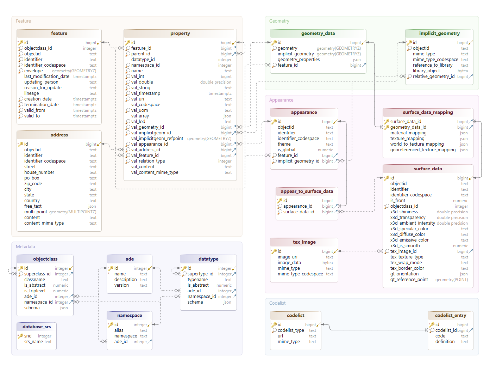

# Relational schema overview

The 3D City Database `v5` is a major revision of the previous `v4` release. The database schema has been
completely redesigned, significantly simplified, and restructured. Unlike `v4`, it no longer uses individual feature
tables with dedicated attribute columns. Instead, the schema is streamlined with fewer tables, including a single
`FEATURE` table for storing all features and objects, and a single `PROPERTY` table that holds most attributes and
associations.

The following figure illustrates the complete 3DCityDB `v5` relational database schema.

/// figure-caption
Relation schema of the 3DCityDB `v5`.
///

All tables of the relation schema are logically grouped into five modules, which are discussed in the
following chapters:

- **Feature module**: Contains the core tables for storing feature information, excluding geometry and appearance data.
- **Geometry module**: Contains tables for storing both explicit and implicit geometry data.
- **Appearance module**: Contains tables for storing appearance information.
- **Metadata module**: Holds meta-information about features and their properties.
- **Codelist module**: Stores codelists with their corresponding values.

!!! note
    Although conceptually the database model is applicable to any database system, this chapter uses
    PostgreSQL-specific figures and examples.
