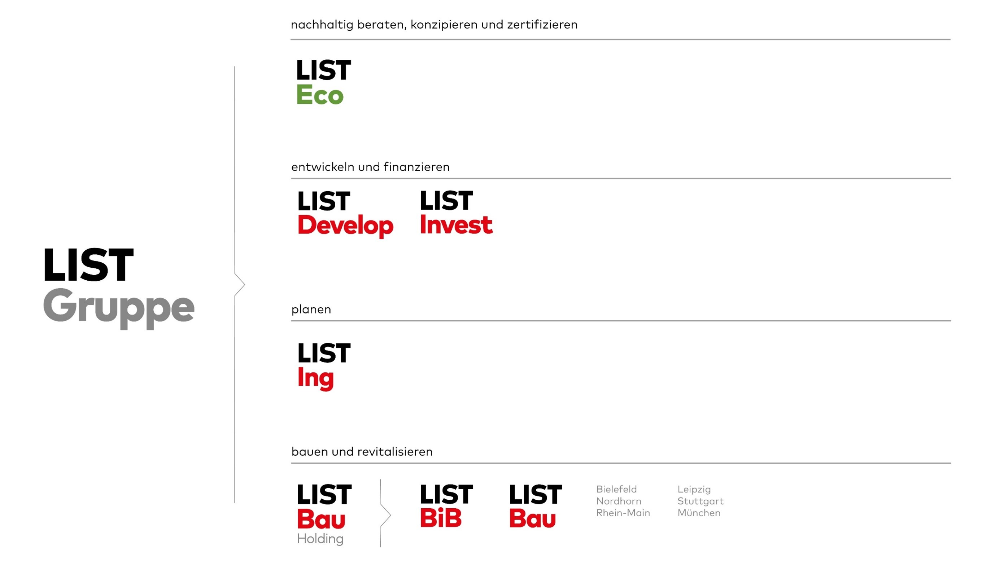

## English

[Hier](#deutsch) geht's zur deutschen Fassung dieser Seite.

### Company description

[LIST Eco GmbH & Co KG](https://list-eco.de){target="blank"} is part of the [LIST Group](https://www.list-gruppe.de/){target="blank"} and develops holistic sustainability concepts for EU taxonomy-compliant real estate and future-proof neighborhoods. The company advises investors, property owners, project developers, cities and municipalities on long-term sustainability strategies across all disciplines and life cycles. LIST Eco's specialists use GIS and BIM-based optimization methods to carry out various analyses - from life cycle assessments to circularity assessments. The service portfolio also includes all standard certifications.

LIST AG is the holding company of the LIST Group and manages it economically, strategically and culturally. The LIST Group sees itself as a real estate service provider that has already developed, (digitally) planned, built and revitalized over 3,500 real estate projects throughout Germany. In general, the product spectrum ranges from logistics and production halls to retail properties and residential and social real estate in a neighborhood context. The Group has concentrated the various skills required for this in twelve companies with over 700 employees at 11 locations. One of these companies is LIST Eco, which was previously located internally as the LIST Group's sustainability team as an “in-house consultant” and was spun off in October 2022.

### Specialist for sustainable cities and neighborhoods

In the field of cities and districts, the 50-strong team specializes in

- project-specific ambition workshops
- Pre-checks and audits for neighborhood certification
- Support for urban planning competitions
- Neighborhood climate risk analyses and biodiversity concepts
- Simulations (energy, flow, etc.) and PV potential analyses
- Creation of digital twins for city models and GIS data management

More about LIST Eco at: [list-eco.de](https://www.list-gruppe.de/nachhaltigkeit/list-eco/){target="blank"}

### Your contact: Bruno Willenborg

{ align="right" width="250"} M.Sc. Bruno Willenborg has been working on various simulation and analysis methods at the neighborhood and city level with semantic 3D city models as part of his ongoing doctorate at the Chair of Geoinformatics at the Technical University of Munich.
Another thematic focus is data management with open standards for digital twins, smart cities and the Internet of Things. At LIST Eco, Bruno Willenborg is an expert in digital twins, large-scale analysis methods with 3D city models and is responsible for software, cloud, and AI development. For 3DCityDB, he is primarily responsible for cloud development and CI/CD.

[:material-contacts: Contact](https://www.list-gruppe.de/vcard/?vcard=wgmVbxGSPWSSkE8t5PmQ4xGYZ){target="blank"}

## Deutsch

Please find the english version of this page [here](#english).

### Unternehmensbeschreibung

Die [LIST Eco GmbH & Co. KG](https://list-eco.de){target="blank"} ist Teil der [LIST Gruppe](https://www.list-gruppe.de/){target="blank"} und entwickelt ganzheitliche Nachhaltigkeitskonzepte für EU-Taxonomie-konforme Immobilien und zukunftsfähige Quartiere. Bei Fragen zu einer langfristigen Nachhaltigkeitsstrategie steht das Unternehmen Investoren, Bestandshaltern, Projektentwicklern sowie Städten und Kommunen disziplin- und lebenszyklusübergreifend beratend zur Seite. Dabei führen die Spezialist:innen von LIST Eco mithilfe von GIS und BIM-basierten Optimierungsverfahren verschiedene Analysen durch – von der Ökobilanz bis zur Zirkularitätsbewertung. Ebenfalls gehören alle gängigen Zertifizierungen zum Leistungsportfolio.

Die LIST AG ist die Holding der LIST Gruppe und führt diese wirtschaftlich, strategisch und kulturell. Die LIST Gruppe versteht sich als Immobiliendienstleister, der bundesweit bereits über 3500 Immobilienprojekte entwickelt, (digital) geplant, gebaut und revitalisiert hat. Generell reicht das Produkt-Spektrum von Logistik- und Produktionshallen über Handelsobjekte bis hin zu Wohn- und Sozialimmobilien im Quartierskontext. Die unterschiedlichen Kompetenzen, die hierfür notwendig sind, hat die Unternehmensgruppe in zwölf Gesellschaften mit über 700 Mitarbeitenden an 11 Standorten konzentriert. Eine dieser Gesellschaften ist die LIST Eco, die vorher als das Team Nachhaltigkeit der LIST Gruppe als "Inhouse-Berater" intern angesiedelt war und seit Oktober 2022 ausgegründet wurde.

### Spezialist für nachhaltige Städte und Quartiere

Im Bereich Städte und Quartiere hat sich das 50-köpfige Team spezialisiert auf:

- projektspezifische Ambitionsworkshops
- Pre-Checks und Audit zur Quartierszertifizierung
- Begleitung städtebaulicher Wettbewerbe
- Quartiers-Klimarisikoanalysen und Biodiversitätskonzepte
- Simulationen (Energie, Strömung etc.) und PV-Potenzialanalysen
- Erstellung digitaler Zwillinge für Stadtmodelle sowie GIS-Datenmanagement

Mehr über LIST Eco unter: [list-eco.de](https://www.list-gruppe.de/nachhaltigkeit/list-eco/){target="blank"}

### Ihr Kontakt: Bruno Willenborg

{ align="right" width="250"} M.Sc. Bruno Willenborg hat sich im Rahmen seiner laufenden Promotion am Lehrstuhl für Geoinformatik an der Technischen Universität München mit verschiedenen Simulations- und Analyseverfahren auf Quartiers- und Stadtebene mit semantischen 3D-Stadtmodellen befasst.
Ein weiterer thematischer Schwerpunkt ist das Datenmanagement mit offenen Standards für Digitale Zwillinge, Smart Cities und dem Internet der Dinge. Bruno Willenborg ist bei LIST Eco Experte für Digitale Zwillinge, großmaßstäbliche Analyseverfahren mit 3D-Stadtmodellen und betreut die Bereiche Software-, Cloud- und KI-entwicklung. Für die 3DCityDB betreut die Bereiche vornehmlich Cloudentwicklung und CI/CD.

[:material-contacts: Kontakt](https://www.list-gruppe.de/vcard/?vcard=wgmVbxGSPWSSkE8t5PmQ4xGYZ){target="blank"}

/// caption
///
