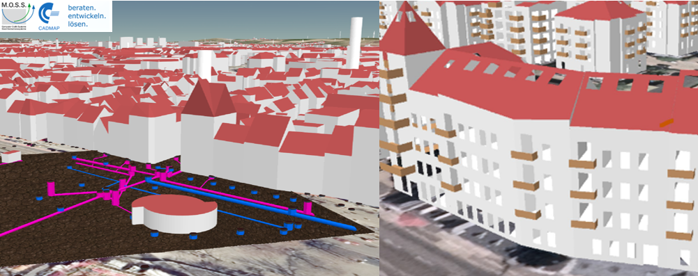

# About M.O.S.S. Computer Grafik Systeme GmbH
[M.O.S.S. Computer Grafik Systeme GmbH](https://www.moss.de/) offers intelligent
geo and IT solutions to use geoinformation sustainably and profitably.
Solutions from M.O.S.S. allow large data sets to be efficiently built,
managed, and used to shape and improve administrative and business processes.

As a provider of one-stop solutions, M.O.S.S. offers not only the development
and distribution of [our software family moGI](https://www.moss.de/mogi/) but
also competent consulting, training, and services. Our software developments
and services are tailored to the individual needs of our customers.
We place the greatest emphasis on optimizing large geo-data volumes of vector,
but especially raster data, point clouds, and 3D, as well as their integration 
into existing IT and process landscapes.

The professional focus is in the area of public administration (surveying, forestry, 
and environmental authorities), industry, and renewable energies, in particular wind 
turbines. The needs of users are met with technically mature and practical specialist 
applications and the future of solutions is shaped together with active user networks.

Customer support is provided through the headquarters in Taufkirchen near Munich and 
the branch office in Dresden as well as [CADMAP Consulting Ingenieurgesellschaft mbH](https://www.cadmap.de/) 
in Essen, a subsidiary of M.O.S.S.

## 3D CityDB and moGI
Within the previous M.O.S.S. product suite novaFACTORY, the 3D City Database has
been used since 2011 as the primary storage container for 3D and CityGML-based data.
Consequently, the new software generation moGI continues to incorporate the 3D CityDB,
ensuring seamless integration and continuity for users. In M.O.S.S. public administration 
customer projects, millions of CityGML objects are imported, managed, and exported by moGI
and the integrated 3D City Database.

## moGI 3D-Production and 3D-Feature
moGI automates 3D object creation from 2D geometries in the moGI 3D-Production module, using CityGML 
and 3D CityDB for data management and export in various formats via the 3D-Feature module. It enriches 
models with additional data and ensures efficient web visualization, supporting AR devices e.g. Microsoft Hololense.

3D data enhances analyses like damage prediction and solar potential, improving communication 
with realistic models. CityGML and 3D CityDB are crucial for standardizing and managing 3D geospatial data, 
making it easier to integrate and utilize across different platforms and applications. This approach ensures 
comprehensive and accurate 3D data representation, benefiting various fields from urban planning to 
environmental monitoring.

